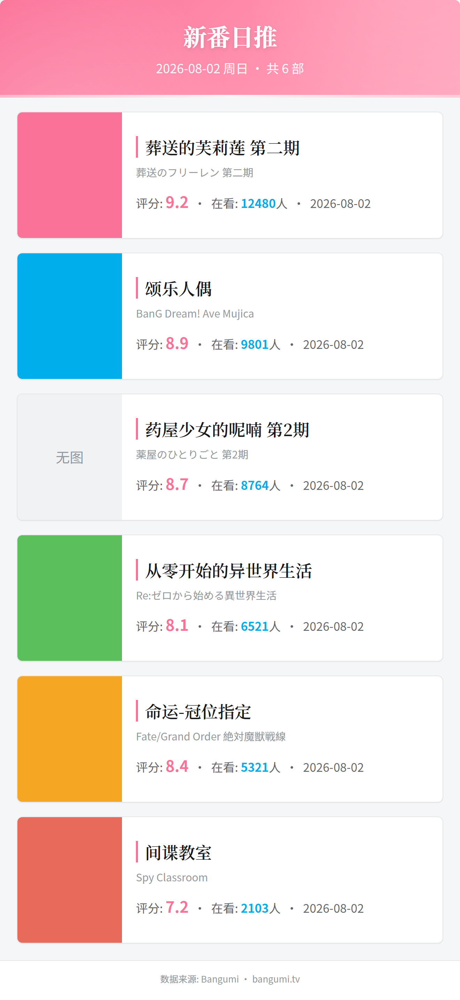

<h1 align="center">新番日推/astrbot_plugin_bangumi_calendar</h1>

<p align="center">
  
</p>

<p align="center">
  
  
  
  =4.26.0-orange?style=flat" alt="AstrBot version">
</p>

每日定时推送 Bangumi 今日新番日历卡片图至群聊。

<p align="center">
  
</p>

## 功能特性

- 每日定时向指定群聊推送今日新番日历卡片（PNG 图片）
- 卡片包含：封面缩略图、中/日文名、评分、Bangumi 全站排名（Rank 胶囊）、在看人数、首播日期、类型标签
- 排序支持 **Rank 优先**（先按 Bangumi 排名高到低，未上榜按评分高到低）与在看人数，方向可配
- 支持**评分下限 / 在看人数下限**过滤（可开关，双开时同时满足才显示）
- 标签智能筛选：来源（漫画改/小说改等）→ 放送方式（TV/WEB/OVA 等）→ 题材，最多 5 个，按添加人数排序
- 支持手动触发推送和即时查看今日新番
- 推送时间、推送数量、排序方式可配置
- 封面图本地缓存（30 天自动清理），减少重复下载
- 支持配置 HTTP/SOCKS5 代理，兼容环境变量回退
- 高清渲染（ultra 像素比），正文微软雅黑，作者署名

## 推送卡片展示图

<p align="center">
  
</p>

## 安装

### 方法一：通过插件市场安装（推荐）

1. 打开 AstrBot WebUI → 插件管理 → 插件市场。
2. 添加插件源（如尚未添加）：
   - 源名称：`AstrBot Official Plugin Market`
   - 源地址：`https://cloud-test.astrbot.app/api/v1/market/plugins.json`
3. 在插件市场中搜索 **新番日推**（`astrbot_plugin_bangumi_calendar`），点击安装。
4. 等待安装完成，确认插件已启用。

### 方法二：从 GitHub 安装

1. 打开 AstrBot WebUI → 插件管理 → 新增插件。
2. 选择 **从 GitHub 安装**。
3. 填入仓库地址：
   ```
   https://github.com/NoFizz/astrbot_plugin_bangumi_calendar
   ```
4. 等待安装完成，确认插件已启用。

### 方法三：手动安装

1. 将本仓库克隆或下载到 AstrBot 的插件目录：
   ```bash
   cd AstrBot/data/plugins
   git clone https://github.com/NoFizz/astrbot_plugin_bangumi_calendar.git
   ```
2. 安装依赖：
   ```bash
   pip install -r astrbot_plugin_bangumi_calendar/requirements.txt
   ```
3. 在 AstrBot WebUI 中重载插件，或重启 AstrBot。

### 安装后检查

- 确认 `requirements.txt` 中的依赖已正确安装。
- 在 WebUI 插件管理中确认插件状态为"已启用"且无报错。
- 配置推送目标 UMO 和推送时间后即可使用。

## 配置说明

在 AstrBot WebUI 插件管理中点击本插件进行配置。

| 配置项 | 类型 | 默认值 | 说明 |
|--------|------|--------|------|
| `umos` | list | `[]` | 推送目标 UMO 列表 |
| `push_time` | string | `07:00` | 每日推送时间（H:MM 或 HH:MM，服务器时区） |
| `max_items` | int | `0` | 每天最大推送番数，0 为不限制 |
| `sort_by` | string | `score` | 排序依据（评分（Rank优先）/ 在看人数） |
| `sort_order` | string | `desc` | 排序方向（降序 / 升序） |
| `proxy` | string | 空 | 代理地址，留空使用直连 |
| `max_retries` | int | `3` | API 请求最大重试次数 |
| `enable_score_min` | bool | `false` | 启用评分下限过滤 |
| `score_min` | float | `0` | 评分下限（需启用上方开关） |
| `enable_doing_min` | bool | `false` | 启用在看人数下限过滤 |
| `doing_min` | int | `0` | 在看人数下限（需启用上方开关） |

**UMO 格式**：`Bot名:GroupMessage:群号`，例如 `AstrBot:GroupMessage:123456789`

**代理格式**：支持 `http://127.0.0.1:7897` 或 `socks5://127.0.0.1:1080`

## 使用示例

| 中文指令 | 英文指令 | 说明 | 权限 |
|----------|----------|------|------|
| `/新番 今日` | `/bangumi today` | 在当前聊天查看今日新番卡片 | 所有人 |
| `/新番 推送` | `/bangumi push` | 手动推送到所有已配置目标 | 管理员 |
| `/新番 状态` | `/bangumi status` | 查看插件运行状态与下次推送倒计时 | 管理员 |

## 依赖要求

- Python >= 3.10
- AstrBot >= 4.26.0
- httpx[socks]

## 数据存储与隐私

- **封面缓存**：番剧封面图缓存在插件目录的 `covers/` 下，30 天自动清理。
- **数据来源**：从 [Bangumi API](https://api.bgm.tv/calendar) 获取公开放送日历数据，无需认证，不上传任何用户数据。

## 技术细节

- **数据源**：[Bangumi 每周放送日历 API](https://bangumi.github.io/api/)（`https://api.bgm.tv/calendar`），无需认证
- **渲染**：HTML + Jinja2 模板 → AstrBot 内置 `html_render`（Playwright）→ PNG 图片
- **封面处理**：宿主机预下载封面并转 base64 data URI 嵌入 HTML，解决 Docker 内 Playwright 无法加载外部图片的问题
- **网络**：所有 HTTP 请求使用 `httpx`，启用 `follow_redirects`，代理优先读取配置、回退到环境变量
- **排序**：评分模式为 Rank 优先（先按 Bangumi 全站排名高到低，未上榜的按评分高到低）；在看人数模式按在看数排序。排序后可选按评分/在看人数下限过滤（开关各自生效，同时开启时须同时满足），最后按 `max_items` 截断
- **容错**：API 请求可配置重试次数（默认 3 次，线性退避），渲染/推送失败静默降级并记录日志

## FAQ / 故障排查

### Q1：推送时间配置没有生效？

`push_time` 格式不合法（不是 `H:MM` 或 `HH:MM`）时，解析会失败并回退到默认时间 `07:00`。请检查配置值，例如 `7:00`、`07:00` 都是合法格式。

### Q2：到点没有收到推送卡片？

卡片发送依赖渲染环节，`html_render` 需要 AstrBot 的浏览器服务（Puppeteer / t2i）正常运行。渲染或发送失败时会记录日志并静默跳过本次推送，不会抛出异常；API 请求失败会按 `max_retries`（默认 3 次）自动重试。排查步骤：

1. 在 WebUI 插件管理中确认插件已启用且无报错。
2. 确认浏览器服务正常，可先在群里用 `/新番 今日` 手动触发一次。
3. 查看 AstrBot 日志中本插件的渲染与推送错误记录。

### Q3：封面缓存存在哪里？会一直增长吗？

封面图缓存在插件目录的 `covers/` 下。缓存文件超过 30 天未被访问会自动清理，无需手动干预。

### Q4：如何配置代理？

在配置项 `proxy` 中填写代理地址，支持 `http://127.0.0.1:7897` 或 `socks5://127.0.0.1:1080`。留空时回退读取环境变量 `HTTP_PROXY` / `HTTPS_PROXY`，两者均未设置则使用直连。

### Q5：为什么收到重复的推送？

检查配置项 `umos` 中是否有重复的目标 UMO。同一 UMO 出现多次时会对同一群聊推送多次，删除重复项即可。

### Q6：推送时间以什么时区为准？

以服务器本地时间为准，即代码中 `datetime.now()` 所在时区，不受客户端或用户时区影响。部署时请确认服务器时区设置正确。

## 许可证

本项目基于 [AGPL-3.0](LICENSE) 许可证开源。

## 作者

**NoFizz** · [GitHub](https://github.com/NoFizz)

如遇问题或有功能建议，欢迎提交 [Issue](https://github.com/NoFizz/astrbot_plugin_bangumi_calendar/issues)。
